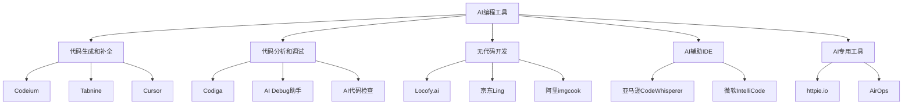

# AI编程工具图谱

```mermaid
graph TD

A[AI编程工具] --> B1[代码生成和补全]
A --> B2[代码分析和调试] 
A --> B3[无代码开发]
A --> B4[AI辅助IDE]
A --> B5[AI专用工具]

B1 --> C1[Codeium]
B1 --> C2[Tabnine]
B1 --> C3[Cursor] 

B2 --> D1[Codiga]
B2 --> D2[AI Debug助手]
B2 --> D3[AI代码检查]

B3 --> E1[Locofy.ai]
B3 --> E2[京东Ling]  
B3 --> E3[阿里imgcook]

B4 --> F1[亚马逊CodeWhisperer]
B4 --> F2[微软IntelliCode]

B5 --> G1[httpie.io]
B5 --> G2[AirOps] 
``` 